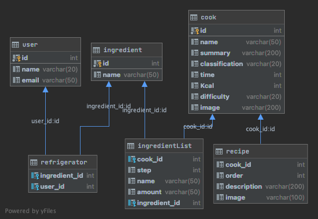

# NodeTutorial

`냉장고를 부탁해` 프로젝트 틀을 짜보는 튜토리얼!

## 튜토리얼 목적

`냉장고를 부탁해` 프로젝트 진행을 단계 별로 나누어 과제를 선정했습니다. 해당 과제들을 수행하며 `Node.js`에 익숙해질 수 있습니다. 과제들에 따라 `브랜치`를 생성하고 과제 완료 시 `PR`을 하면 됩니다. 기능 구현 시 필요한 패키지는 추가로 다운해서 사용하시면 됩니다. 사용 중인 DB는 `MySQL`입니다. 단위 테스트는 `Jest`를 통해 진행할 예정입니다.

### 참고사항

- `src/` 안에 구현해주시면 됩니다.
- `src/app.js` 의 위치는 변경하시면 안됩니다.
- 필요에 따라 `services/`, `utils/`, `validations/`를 `src/` 하위에 만드셔도 됩니다.
- `test/` 는 테스트 폴더입니다. 테스트 코드에 이슈가 발생하면, 직접 수정하시고 PR 해주시거나 이슈 등록해주시면 감사하겠습니다.
- 프로젝트 구조의 이해를 위해 `/hello/{username}`를 기본으로 만들어놨습니다.
- Slack에 남겨둔 임시 AWS 정보를 통해 DB에 연결합니다.

## ERD

DataGrip으로 만든 ERD입니다. UML 다이어그램 형식으로 출력되어 관계의 표시가 애매합니다. 따라서, 관계의 설명을 아래에 서술했습니다.

### user

- 유저 테이블입니다.
- `id`: `user`의 pk
- `email`: OAuth 시 사용자를 구분하기 위한 email

### ingredient

- 재료 테이블 입니다.
- `id`: `ingredient`의 pk
- `name`: 재료 이름

### refrigerator

- 냉장고 테이블입니다.
- `user`와 `ingredient`의 n:m 관계 테이블입니다.
- `ingredient_id`과 `user_id`는 unique합니다.
- `ingredient_id`: `ingredient`의 fk
- `user_id`: `user_id`의 fk

### cook

- 요리 목록 테이블입니다.
- `name`: 요리 이름
- `summary`: 요리 간단 설명
- `classification`: 음식의 종류(ex. 한식, 중식 ...)
- `time`: 조리 시간
- `Kcal`: 칼로리
- `difficulty`: 조리 난이도
- `image`: 완성된 요리의 이미지

### ingredientList

- 요리에 사용되는 재료 목록 테이블입니다.
- `cook`과 `ingredient`의 n:m 관계 테이블입니다.
- `cook_id`와 `ingredient_id`는 unique합니다.
- `cook_id`: `cook`의 fk
- `step`: 재료의 순서
- `name`: 재료 이름
- `amount`: 재료의 양
- `ingredient_id`: `ingredient`의 fk

### recipe

- 조리 순서 테이블입니다.
- `cook`과 1:n 관계입니다.
- `cook_id`: `cook`의 fk
- `order`: 조리 순서
- `description`: 조리 설명
- `image`: 조리 과정 이미지

## 과제 목록

### MySQL과 Sequelize 연동

- 사전에 제공한 AWS의 MySQL과 Sequelize 연동을 해주세요.
- 위의 ERD를 참고해서 model strategy 코드를 작성해주시면 됩니다.
- `configs/index.js`에 Sequelize env 세팅을 해놨습니다. 알맞게 세팅해서 DB와 연동하면 됩니다.
- `src/models` 폴더에 작성해주시면 됩니다.

### 냉장고 API

- 재료 `추가`, `삭제`, `검색` API를 만들어주세요.
- `(주의)`로그인 기능 구현 이전이기 때문에 `user` 테이블에 `유저 데이터`를 입력해주세요!

### 레시피 API

- 레시피 `검색`, 특정 레시피 `조회` API를 만들어주세요.

### 로그인

- Google, Apple, Kakao `OAuth` 기능을 구현하세요.
- `OAuth` 이후 `JWT`(`Access Token`, `Refresh Token`)를 발급해 `Stateless Server`를 구현하세요.
